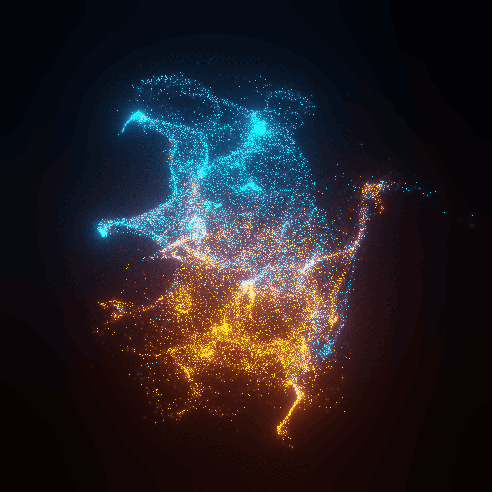

---English---

This is a Blender particle visualization scene.

Thousands of glowing particles form an abstract flowing structure with blue and orange light interacting in space.

Rendering Settings

Rendering Engine: Eevee

Sampling: 64

Denoising: None

Check out the animation!

https://drive.google.com/your-video-link

---

---日本語---

これはBlenderで作成されたパーティクルビジュアライゼーションです。

数千の発光粒子が流れるような抽象形状を作り、
青とオレンジの光が空間で相互作用する表現になっています。

レンダリング設定

レンダリングエンジン：Eevee
サンプリング：64
ノイズ除去：なし

動画もぜひご覧ください！

https://drive.google.com/your-video-link

